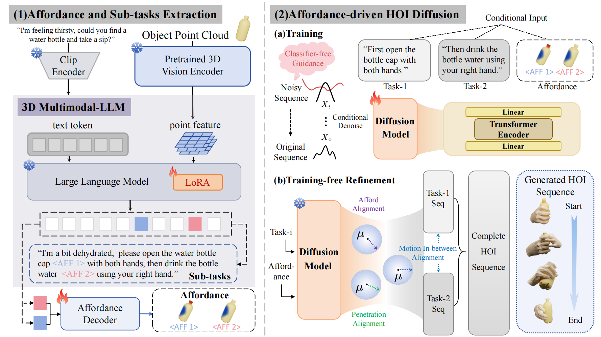

# [NeurIPS 2025 Oral] OpenHOI: Open-World Hand-Object Interaction Synthesis with Multimodal Large Language Model

This is the offical code repo for **NeurIPS 2025 Oral** paper **OpenHOI: Open-World Hand-Object Interaction Synthesis with Multimodal Large Language Model**

[[paper]](https://arxiv.org/abs/2505.18947) [[project page]](http://openhoi.github.io/)

<div align="center">
    
</div>


**We will release our code as soon as possible**

Any Question, feel free to contact zhangzhh2024@shanghaitech.edu.cn

# Acknowledgement
Thanks for the excellent work [ShapeLLM](https://github.com/qizekun/ShapeLLM/),[Text2HOI](https://github.com/JunukCha/Text2HOI),[DSG](https://github.com/LingxiaoYang2023/DSG2024),[SeqAfford](https://github.com/hq-King/SeqAfford),[GazeHOI](https://github.com/takiee/GazeHOI-toolkit)


# Citation

If you find our work useful in your research, please consider citing

```
@article{zhang2025openhoi,
  title={OpenHOI: Open-World Hand-Object Interaction Synthesis with Multimodal Large Language Model},
  author={Zhang, Zhenhao and Shi, Ye and Yang, Lingxiao and Ni, Suting and Ye, Qi and Wang, Jingya},
  journal={arXiv preprint arXiv:2505.18947},
  year={2025}
}
```